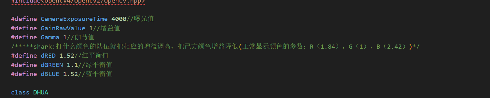
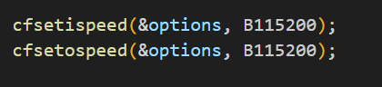
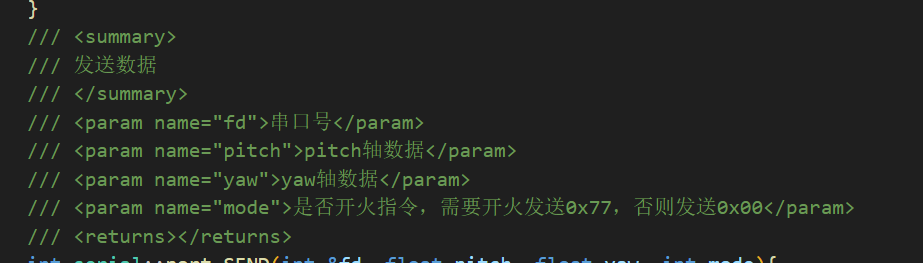

# HHXY-LBT
RoboMaster  LBT战队视觉

### 文件夹说明
该文件夹是代码部分，不包含xml模型文件和驱动相机安装程序

### 代码结构
# buff:
算法部分
# dahua:
大华相机参数部分，如何打开视觉程序后发现曝光度等部分参数有问题可以适当更改dahua.h文件

# Detection :
抄的代码....可以当作底层看待，不必管它
# image:
README.md也就是当前的帮助文档的图片路径
# Number:
识别数字用的训练模型代码
# PredictionL:
运动解算代码
# serial:
串口通信代码

这里波特率为115200在serial.cpp的92和93行
发送的数据为12位
包头一位 yaw四位 pitch四位 是否开火两位 包尾一位

# Thread:
是摄像头启动代码，也是程序主入口
### 一些说明
该项目为哨兵上场版本，其余版本其本框架一致，小部分有差异。
次项目算法实现比较简单，全为传统视觉实现，体量较小，能够实现数图案分类和卡尔曼运动预测，能够对目标保持固定帧跟踪（防止装甲板闪烁或丢失目标）。项目一边迭代一边测试，很多代码没有仔细斟酌。实际效果可查看上面提到的网盘或查阅比赛视频。
在此特别感谢战队所有视觉组成员！！

##### 欢迎交流
WX：xiaorui13039811650
